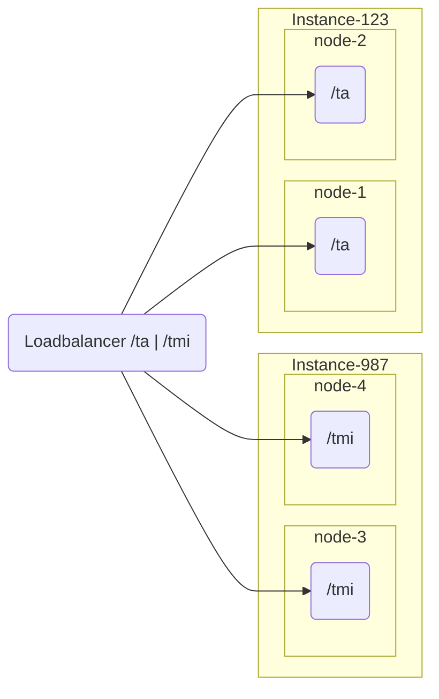

# OpenID Federation Services

The OpenID Federation Services implements necessary apis to support OpenID Federation in accordance
to https://openid.net/specs/openid-federation-1_0.html

This service component can work standalone with management of properties or in managed mode
using a [registry](https://github.com/swedenconnect/openid-federation-registry) sevice to enable management using a web
interface.

## Managed Mode

When this service is running in managed mode it loads its instance configuration from a given registry.

Loading of managed configuration happens _after_ startup, which means application will not be ready for traffic
immediately. The application offers a ready state endpoint to help orchestration tools to know when the service is
ready for traffic.

### Instance groups

To load modules from the registry the service needs to have an instance-id configured.
This informs the service about what instance group it belongs to. Multiple instance that should be configured in the same way and loadbalanced **should**
share the same instance id.

E.g. Pseudo Configuration of 4 nodes that is divided into two instance groups



## Modules

The service is split into multiple modules which is a group of OpenID Federation endpoints.
Each module _has_ to belong to a given entity that is present in properties or registry.

### TrustAnchor / Intermediate

#### Subordinate Listing

Last Updated
for: **[OpenId Federation Draft 41](https://openid.net/specs/openid-federation-1_0.html#name-subordinate-listing-request)**

`GET /subordinate_listing`

*Query Parameters*

| Required | Name          | Description                                                            |
|----------|---------------|------------------------------------------------------------------------|
| No       | entity_type   | Filters the response on entity type                                    |
| No       | trust_marked  | Filters the response with entities that contain ATLEAST one Trust Mark |
| No       | trust_mark_id | Filters the response with entities containing a specific Trust Mark    |
| No       | intermediate  | Filters the response to only contain intermediates.                    |

#### Fetch

Last Updated
for: **[OpenId Federation Draft 41](https://openid.net/specs/openid-federation-1_0.html#name-fetch-subordinate-statement)**

`GET /fetch`

*Query Parameters*

| Required | Name | Description                                                        |
|----------|------|--------------------------------------------------------------------|
| Yes      | sub  | The subject for which the Subordinate Statement is being requested |

### TrustMark

#### Trust Mark Endpoint

Last Updated
for: **[OpenId Federation Draft 41](https://openid.net/specs/openid-federation-1_0.html#name-trust-mark-endpoint)**

`GET /trust_mark`

*Query Parameters*

| Required | Name          | Description                                       |
|----------|---------------|---------------------------------------------------|
| Yes      | trust_mark_id | Trust Mark identifier                             |
| Yes      | sub           | The subject for which the Trust Mark is issued to |

#### Trust Mark Status

Last Updated
for: **[OpenId Federation Draft 41](https://openid.net/specs/openid-federation-1_0.html#name-trust-mark-status)**

`GET /trust_mark_status`

*Query Parameters*

| Required | Name          | Description                                                    |
|----------|---------------|----------------------------------------------------------------|
| Yes      | trust_mark_id | Trust Mark identifier                                          |
| Yes      | sub           | The subject for which the Trust Mark is issued to              |
| No       | iat           | Seconds Since the Epoch. Time when this Trust Mark was issued. |

#### Trust Mark Listing

Last Updated
for: **[OpenId Federation Draft 41](https://openid.net/specs/openid-federation-1_0.html#name-trust-marked-entities-listi)**

`GET /trust_mark_listing`

*Query Parameters*

| Required | Name          | Description                                 |
|----------|---------------|---------------------------------------------|
| Yes      | trust_mark_id | Trust Mark identifier                       |
| No       | sub           | Filter response to only contain this entity |

### Resolver

#### Resolve

Last Updated
for: **[OpenId Federation Draft 41](https://openid.net/specs/openid-federation-1_0.html#name-trust-marked-entities-listi)**

`GET /resolve`

*Query Parameters*

| Required | Name         | Description                                                    |
|----------|--------------|----------------------------------------------------------------|
| Yes      | sub          | Subject to resolve                                             |
| Yes      | trust_anchor | Trust Anchor to resolve via                                    |
| No       | entity_type  | Filter response to only contain entities with this entity type |

#### Discovery

Last Updated
for: **[Version: 1.0 - draft 05 - 2024-06-14](https://github.com/oidc-sweden/specifications/blob/main/swedish-oidc-fed-profile.md#62-discovery-request)**

`GET /discovery`

*Query Parameters*

| Required | Name          | Description                                                    |
|----------|---------------|----------------------------------------------------------------|
| Yes      | trust_anchor  | Trust Anchor to resolve via                                    |
| No       | entity_type   | Filter response to only contain entities with this entity type |
| No       | trust_mark_id | Filter response to only contain entities with this trust mark  |

## Creating a release

Releases are created by Github-actions on tagged commits.

e.g.

```bash
git tag v0.0.0
git push origin v0.0.0
```

Will result in a release and a docker image with that tag.
