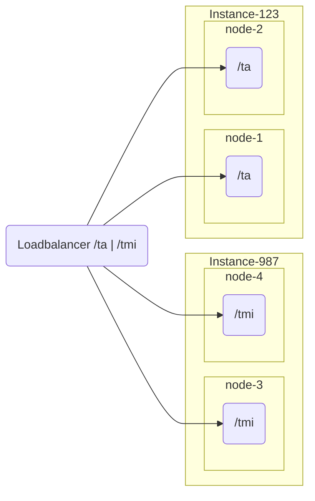

# OpenID Federation Services

## Getting Started (Demo Mode)

Demo mode runs a self-contained federation on `localhost:8080` with no external dependencies. It includes a Trust Anchor, Intermediate, OpenID Provider, Relying Party, and Resolver — all pre-configured with in-memory storage.

### Start

```bash
./run-demo.sh
```

Or directly:

```bash
mvn -pl oidf-services spring-boot:run -Dspring-boot.run.profiles=demo
```

### Demo Federation Topology

```
Trust Anchor (http://localhost:8080/ta)
└── Intermediate (http://localhost:8080/im)
    ├── OpenID Provider (http://localhost:8080/op)
    └── Relying Party (http://localhost:8080/rp)

Resolver (http://localhost:8080/resolver) → anchored at /ta
```

### Verify

Once running, verify all endpoints with:

```bash
./check-demo.sh
```

All lines should print `OK`. Exit code `0` on full pass, non-zero if any fail.

### Example Requests

**Entity Configurations**

```bash
# Trust Anchor
curl http://localhost:8080/ta/.well-known/openid-federation

# Intermediate
curl http://localhost:8080/im/.well-known/openid-federation


# OpenID Provider
curl http://localhost:8080/op/.well-known/openid-federation


# Relying Party
curl http://localhost:8080/rp/.well-known/openid-federation


# Resolver
curl http://localhost:8080/resolver/.well-known/openid-federation

```

**Subordinate Listing**

```bash
# All subordinates of Trust Anchor
curl "http://localhost:8080/ta/subordinate_listing"

# All subordinates of Intermediate
curl "http://localhost:8080/im/subordinate_listing"
```

**Fetch Subordinate Statements**

```bash
# TA's statement about Intermediate
curl "http://localhost:8080/ta/fetch?sub=http://localhost:8080/im"

# IM's statement about OP
curl "http://localhost:8080/im/fetch?sub=http://localhost:8080/op"

# IM's statement about RP
curl "http://localhost:8080/im/fetch?sub=http://localhost:8080/rp"
```

**Resolve**

```bash
# Resolve OP via Trust Anchor
curl "http://localhost:8080/resolver/resolve?sub=http://localhost:8080/op&trust_anchor=http://localhost:8080/ta"

# Resolve RP via Trust Anchor
curl "http://localhost:8080/resolver/resolve?sub=http://localhost:8080/rp&trust_anchor=http://localhost:8080/ta"

# Resolve with entity type filter
curl "http://localhost:8080/resolver/resolve?sub=http://localhost:8080/op&trust_anchor=http://localhost:8080/ta&entity_type=openid_provider"
```

**Discovery**

```bash
# Discover all entities under Trust Anchor
curl "http://localhost:8080/resolver/discovery?trust_anchor=http://localhost:8080/ta"

# Discover only OpenID Providers
curl "http://localhost:8080/resolver/discovery?trust_anchor=http://localhost:8080/ta&entity_type=openid_provider"
```


The OpenID Federation Services implements necessary apis to support OpenID Federation in accordance
to https://openid.net/specs/openid-federation-1_0.html

This service component can work standalone with management of properties or in managed mode
using a [registry](https://github.com/swedenconnect/openid-federation-registry) sevice to enable management using a web
interface.

## Managed Mode

When this service is running in managed mode it loads its instance configuration from a given registry.

Loading of managed configuration happens _after_ startup, which means application will not be ready for traffic
immediately. The application offers a ready state endpoint to help orchestration tools to know when the service is
ready for traffic.

### Instance groups

To load modules from the registry the service needs to have an instance-id configured.
This informs the service about what instance group it belongs to. Multiple instance that should be configured in the same way and loadbalanced **should**
share the same instance id.

E.g. Pseudo Configuration of 4 nodes that is divided into two instance groups


```mermaid
graph LR
    subgraph Instance-987
        subgraph node-3
            123-tmi-1("/tmi");
        end
        subgraph node-4
            123-tmi-2("/tmi");
        end
    end
    subgraph Instance-123
        subgraph node-1
            123-ta-1("/ta");
        end
        subgraph node-2
            123-ta-2("/ta");
        end
    end
    loadbalancer("Loadbalancer /ta | /tmi") --> 123-ta-1 & 123-ta-2;
    loadbalancer --> 123-tmi-1 & 123-tmi-2;
```

## Modules

The service is split into multiple modules which is a group of OpenID Federation endpoints.
Each module _has_ to belong to a given entity that is present in properties or registry.

### TrustAnchor / Intermediate

#### Subordinate Listing

`GET /subordinate_listing`

*Query Parameters*

| Required | Name          | Description                                                            |
|----------|---------------|------------------------------------------------------------------------|
| No       | entity_type   | Filters the response on entity type                                    |
| No       | trust_marked  | Filters the response with entities that contain ATLEAST one Trust Mark |
| No       | trust_mark_type | Filters the response with entities containing a specific Trust Mark    |
| No       | intermediate  | Filters the response to only contain intermediates.                    |

#### Fetch

`GET /fetch`

*Query Parameters*

| Required | Name | Description                                                        |
|----------|------|--------------------------------------------------------------------|
| Yes      | sub  | The subject for which the Subordinate Statement is being requested |

### TrustMark

#### Trust Mark Endpoint

`GET /trust_mark`

*Query Parameters*

| Required | Name          | Description                                       |
|----------|---------------|---------------------------------------------------|
| Yes      | trust_mark_type | Trust Mark identifier                             |
| Yes      | sub           | The subject for which the Trust Mark is issued to |

#### Trust Mark Status

`POST /trust_mark_status`

Request body encoded as `application/x-www-form-urlencoded`.
`GET /trust_mark_status` with the same parameter as a query parameter is still accepted for backwards
compatibility, but POST is what the specification requires.

*Parameters*

| Required | Name       | Description                       |
|----------|------------|-----------------------------------|
| Yes      | trust_mark | The Trust Mark to be validated    |

Response: `200` with content type `application/trust-mark-status-response+jwt`.

#### Trust Mark Listing

`GET /trust_mark_listing`

*Query Parameters*

| Required | Name          | Description                                 |
|----------|---------------|---------------------------------------------|
| Yes      | trust_mark_type | Trust Mark identifier                       |
| No       | sub           | Filter response to only contain this entity |

### Resolver

#### Resolve

`GET /resolve`

*Query Parameters*

| Required | Name         | Description                                                    |
|----------|--------------|----------------------------------------------------------------|
| Yes      | sub          | Subject to resolve                                             |
| Yes      | trust_anchor | Trust Anchor to resolve via                                    |
| No       | entity_type  | Filter response to only contain entities with this entity type |

#### Discovery

`GET /discovery`

*Query Parameters*

| Required | Name          | Description                                                    |
|----------|---------------|----------------------------------------------------------------|
| Yes      | trust_anchor  | Trust Anchor to resolve via                                    |
| No       | entity_type   | Filter response to only contain entities with this entity type |
| No       | trust_mark_type | Filter response to only contain entities with this trust mark  |

## Creating a release

Releases are created by Github-actions on tagged commits.

e.g.

```bash
git tag v0.0.0
git push origin v0.0.0
```

Will result in a release and a docker image with that tag.
