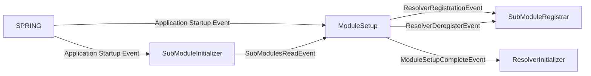

# Startup

Startup Sequence as is with resolver-module being loaded dynamically

```mermaid
graph LR
    SPRING-->|Application Startup Event| ModuleSetup & SubModuleInitializer;
    SubModuleInitializer -->|SubModulesReadEvent| ModuleSetup;
    ModuleSetup -->|ResolverRegistrationEvent| SubModuleRegistrar;
    ModuleSetup -->|ResolverDeregisterEvent| SubModuleRegistrar;
    ModuleSetup -->|ModuleSetupCompleteEvent| ResolverInitializer;
```