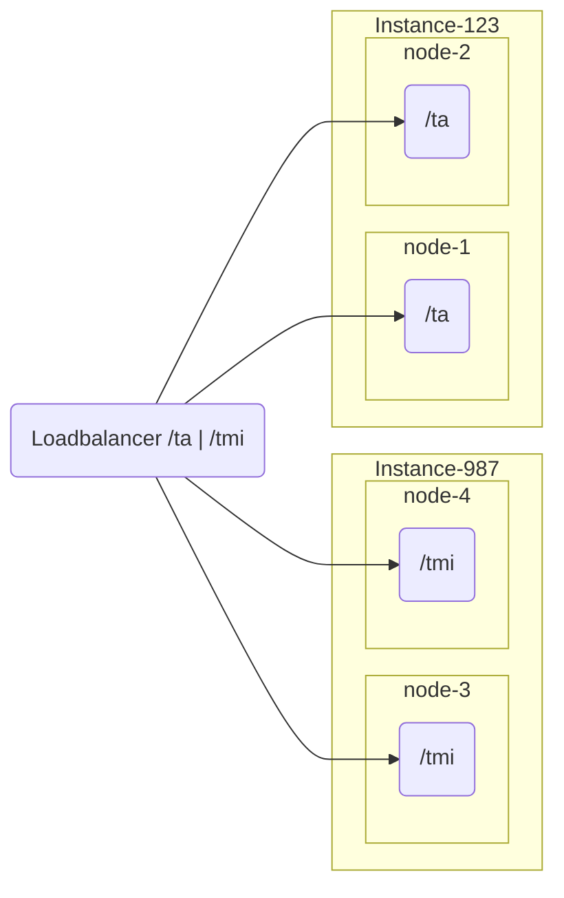

# Using OIDF Registry for Configuration

Instead of static, local configuration (see [Service Configuration](service-configuration.md)), this
service can run in **managed mode**, loading its instance configuration from the
[OpenID Federation Registry](https://github.com/swedenconnect/openid-federation-registry) — a
service that lets you manage trust anchors, entities, policies and trust marks through a web
interface instead of editing configuration files.

When this service is running in managed mode it loads its instance configuration from a given
registry.

Loading of managed configuration happens _after_ startup, which means application will not be ready
for traffic immediately. The application offers a ready state endpoint to help orchestration tools
know when the service is ready for traffic.

## Instance groups

To load modules from the registry the service needs to have an instance-id configured.
This informs the service about what instance group it belongs to. Multiple instance that should be
configured in the same way and loadbalanced **should** share the same instance id.

E.g. Pseudo Configuration of 4 nodes that is divided into two instance groups

See [2.4 Registry Integration](service-configuration.md#24-registry-integration) for the
`federation.registry.integration.*` properties that enable managed mode and configure the
instance-id, and [Management, Health and Observability](service-configuration.md#management-health-and-observability)
for the readiness endpoint orchestration tools should poll.
